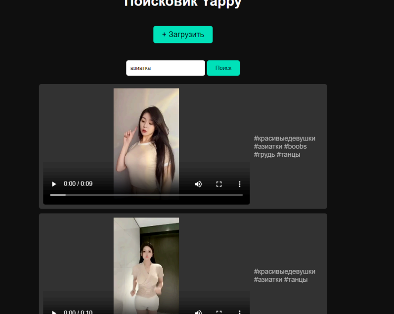
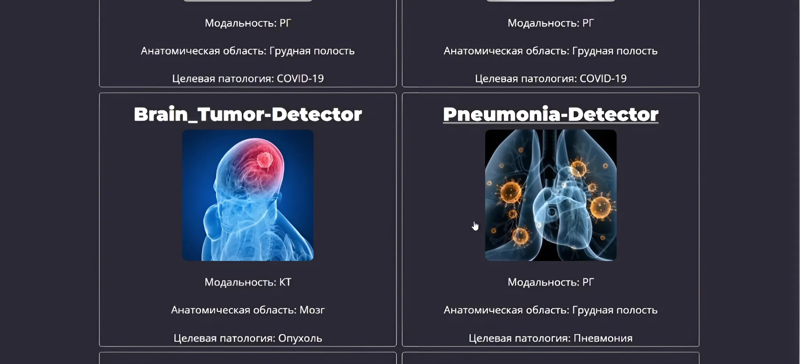
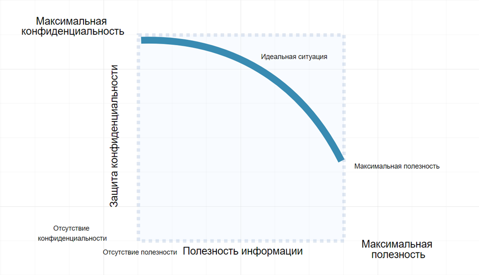

Привет! Меня зовут Данила 👋  
🌇 Живу в Москве  
🔥 **ML Engineer / Data Scientist.** Занимаюсь разработкой и деплоем решений в области CV, NLP и Audio. Активный участник хакатонов (LCT, Transneft).

> 💡 **Забавный факт:** "Не оцениваю результаты генеративки глазами, а провожу Human Evaluation."

**Связаться со мной:**  
🍊 Обязательно пиши в ТГ, если хочешь что-то спросить, предложить или просто пообщаться — [@LichPlease](https://t.me/LichPlease)

---

## 🚀 Избранные проекты

---

#### [DiaBERT ASR Backend](https://github.com/DanilaAniva/DiabertASRBackend)
**Сервис автоматизации голосовых отчетов.**  
*🥇 1-е место Хакатон Транснефть · Whisper-large-v3 · Local LLM (Vikhr)*  
Backend на FastAPI для преобразования голосовых заметок в структурированные DOCX-документы. Пайплайн состоит из **Whisper** (ASR) для транскрибации и **Vikhr-Nemo-12B** (LLM) для извлечения именованных сущностей (NER) и форматирования задач.

    

---

#### [KitMatch](https://github.com/DanilaAniva/kitmatch)
**Система компьютерного зрения для сверки промышленного инструмента.**  
*🏅 LCT 2025 Moscow · Triton Inference Server · Foundational Models*  
Приложение для проверки комплектности наборов инструментов по фото. Использует связку **YOLOv11** для детекции объектов и **DinoV3** для извлечения визуальных признаков (embeddings). Деплой реализован через **Nvidia Triton** для минимизации задержек (Latency).

    

---

#### [Multimodal Video Retrieval](https://github.com/DanilaAniva/MultimodalVideoRetrieval)
**Семантический поиск по видео (Video/Audio/Text).**  
*🏅 LCT 2024 (Yappy) · Hybrid Search · Jina-CLIP*  
Решение проблемы поиска видео без метаданных. Индексация происходит по трем модальностям:  
1. **Visual:** Jina-CLIP (эмбеддинги видеоряда с контекстом 8k).  
2. **Audio:** Nvidia NeMo FastConformer (распознавание речи).  
3. **Text:** EasyOCR (считывание титров и текста в кадре).

    

---

#### [AI-Med-Service](https://github.com/DanilaAniva/AI-med-service)
**Платформа сегментации медицинских снимков.**  
*🔬 Segmentation · Custom UNet++ · EfficientNet Encoder*  
Сервис для анализа рентгеновских снимков (формат DICOM). Реализован полный цикл обучения с использованием **DiceBCELoss** и кастомных шедулеров. В пайплайн встроен **Autoencoder** для предварительной фильтрации аномалий и невалидных изображений.

    

---

#### [DataMasking](https://github.com/DanilaAniva/DataMasking)
**Утилита маскирования персональных данных (PII).**  
*🔒 Data Security · NLP Patterns · PostgreSQL*  
Инструмент для обезличивания дампов баз данных. Автоматически детектирует и скрывает чувствительные данные (номера карт, ИНН, ФИО), используя комбинацию регулярных выражений и NLP-эвристик. Поддерживает работу через ORM Peewee.

    

---
